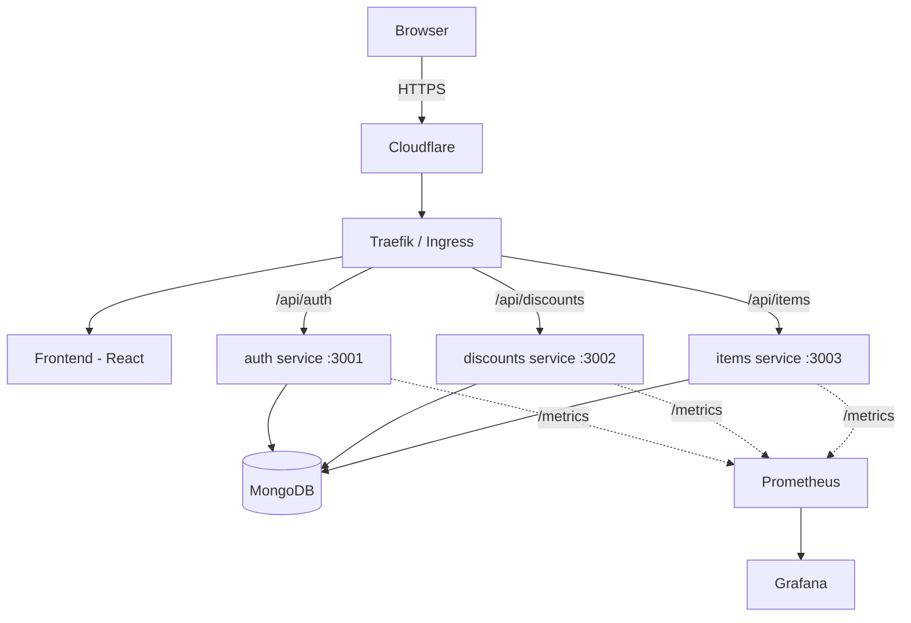

# Restauranty

A food-ordering platform built as three independent Node.js microservices (auth, discounts, items) and a React frontend, deployed and operated as a real, working system rather than a single deployment exercise.

Live demo: https://restauranty.kelenva.com
Status page: https://status.kelenva.com/status/kelenva
Monitoring: https://grafana.kelenva.com

## What this project demonstrates

Most student projects prove you can deploy an app once. This one covers the whole lifecycle: infrastructure as code, container orchestration, automated CI/CD with an approval gate, network security, observability, automated backups with a tested restore, and a permanent, self-hosted home for the app once the graded cloud deployment is retired. A separate add-on, Kubernetty, also covers operating a Kubernetes control plane from scratch rather than just consuming a managed one.

## Architecture

The frontend never talks to MongoDB directly, and the three backend services never talk to each other except through the routing layer. Auth issues JWTs; discounts and items validate them on incoming requests.

## Two live deployments

This app runs in two genuinely separate places, on purpose.

AWS EKS is the cloud-native deliverable. The cluster and its networking were provisioned with Terraform, workloads deployed through Kubernetes manifests, TLS issued automatically by cert-manager and Let's Encrypt, traffic restricted with NetworkPolicies, and the whole thing monitored with Prometheus and Grafana provisioned through Terraform's Helm provider. This environment exists to prove the Kubernetes-specific skills the project is graded on, and it is not meant to run indefinitely — see the note at the end of this document.

Hetzner is the permanent home. It's a self-managed VPS running Docker Compose behind Traefik, with the same four containers, its own CI/CD pipeline, its own Prometheus and Grafana instance, daily automated database backups, and a public status page. This is where the app actually lives long term, since paying for a managed Kubernetes control plane indefinitely doesn't make sense for a project at this scale. Both deployments run from the exact same Docker images, published to Docker Hub.

## Running it locally

There are two ways to run this locally, matching how the project was actually built and debugged.

The first is plain local processes. Start MongoDB in Docker, then run each backend service and the client in its own terminal, with HAProxy in front using the provided config to route requests the same way the production Ingress does.

The second is Docker Compose, which reproduces the exact same setup entirely in containers — Mongo, all three backend services, the frontend, and HAProxy, wired together on one network. Bring the whole thing up with a single command and it behaves identically to running it by hand.

## CI/CD

The pipeline runs on every push that touches actual application code, the Kubernetes manifests, or the workflow file itself — not on documentation-only changes. It installs and tests each service, builds and tags Docker images with the commit hash, pushes them to Docker Hub, and then deploys, gated behind a manual approval step in GitHub before anything touches a live server. The deploy step connects to the Hetzner server over SSH, syncs the current compose configuration, pulls the new images, and runs a real health check against the live site before the run is allowed to succeed.

The portfolio site at kelenva.com has its own separate pipeline, following the same pattern.

## Security

Secrets live in Kubernetes Secrets or environment files, never committed to git or baked into images. CORS is restricted to the real frontend origins rather than left open to any website. Two NetworkPolicies on EKS restrict which pods can reach which — this was verified with a live test rather than just assumed to work. TLS is real and renews automatically on both deployments. The EKS worker nodes carry only the standard minimal AWS-managed permissions, nothing broader. Full detail lives in SECURITY.md.

## Monitoring and backups

Each backend service exposes Prometheus metrics — request counts by status code, user growth over time, and MongoDB connection status. Both deployments run their own Prometheus and Grafana. A public status page shows live uptime for the app, the portfolio site, and Grafana itself.

MongoDB on Hetzner is backed up daily, and the restore path has actually been tested end to end, not just assumed to work because a backup file exists.

## Kubernetty

A separate, standalone exercise proving the other side of the same skill set — operating a Kubernetes control plane, not just deploying onto one. A small highly-available k3s cluster was built from raw EC2 instances: an nginx TCP load balancer in front of two k3s server nodes sharing an external MySQL datastore, with a worker node joined through the load balancer rather than directly to a server. The HA claim wasn't just asserted, it was tested — one control-plane node was stopped while a real workload was running, the cluster and the workload both kept working, and the node rejoined automatically once restarted, with no manual steps. This cluster is temporary and has nothing to do with Restauranty's actual deployment; it exists purely to demonstrate this second skill.

## What actually went wrong, and how it got fixed

These are left in on purpose rather than smoothed over, because working through them honestly is part of what this project is meant to show.

A route in the items service was mounted without its leading slash, which meant requests wouldn't reliably reach it through the routing layer. Found and fixed early, during local development.

Two separate AWS GuardDuty-managed resources — a security group and a VPC endpoint — silently blocked the EKS VPC from tearing down cleanly, on two different occasions, and had to be tracked down and removed manually since Terraform had no visibility into them.

The first version of the EKS cluster was built on a Kubernetes version that had already left AWS's standard support window, and the worker nodes failed to provision as a result. Fixing it meant destroying and rebuilding the cluster on a currently supported version, since EKS won't let you skip several minor versions in a single upgrade.

A shared JWT signing secret was correctly wired into the auth service but missed on the other two, which caused auth to crash-loop while discounts and items quietly carried a broken authorization path that hadn't been exercised yet.

After a routine pod reschedule, traffic between nodes on port 80 started timing out. The node security group covered the ephemeral port range but had a real gap just below it. The fix was a rule allowing all TCP traffic between members of the node's own security group, and that fix was then written back into Terraform so it survives any future rebuild instead of only existing as a manual patch.

On the Hetzner side, Traefik couldn't reach the backend containers even though the routing rules and labels were correct. The containers were attached to two different Docker networks, and Traefik needs to be told explicitly which one to actually use when a container has more than one.

A post-deploy health check kept failing even after adding retries with backoff, which was itself the useful signal — a real timing problem would eventually succeed on a retry, and this one never did. The actual cause was that the check was using plain HTTP while the service's router only accepted HTTPS. Fixing the protocol, not the timing, resolved it cleanly on the very next attempt.

## Retiring the EKS deployment

The EKS cluster is deliberately temporary. Once the Kubernetes-specific work has been captured for grading, the plan is to run a full teardown, leaving the app running only on Hetzner — which is already serving live traffic on its own. Removing the AWS side at that point causes no downtime, since nothing on Hetzner depends on it.
